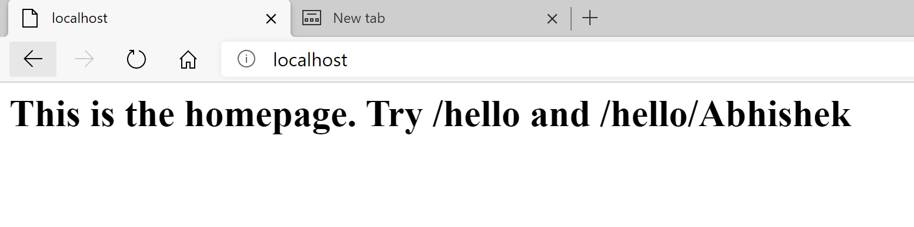
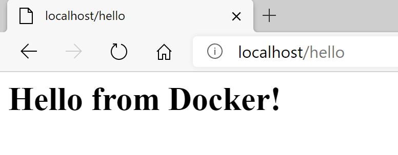
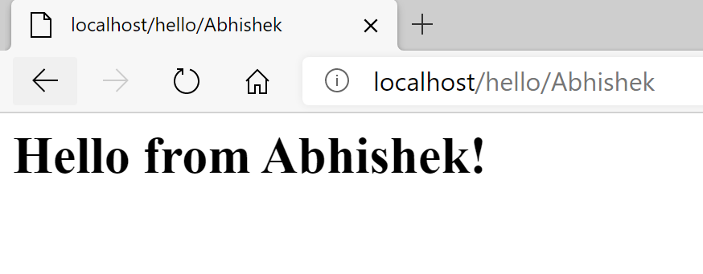

# Introduction to Docker

Docker is a set of platform as a service (PaaS) products that use OS-level virtualization to deliver software in packages called containers.
Containers are isolated from one another and bundle their own software, libraries and configuration files, they can communicate with each other through well-defined channels.
All containers are run by a single operating system kernel and therefore use fewer resources than virtual machines.

## Softwares to Download

Docker Desktop for Windows or Mac from <https://www.docker.com>
WSL2 in case of Windows only

## Lets start with running few commands

*1*) Find out the version of Docker in your Machine.

``` cmd/docker
docker –-version
```

In my machine I got following output

``` text
Docker version 19.03.12, build 48a66213fe
```

*2*) Running a "Helllo-World" container on Docker

``` cmd/docker
docker run hello-world
```

You will see something like this:
``` text
Unable to find image 'hello-world:latest' locally
latest: Pulling from library/hello-world
0e03bdcc26d7: Pull complete
Digest: sha256:4cf9c47f86df71d48364001ede3a4fcd85ae80ce02ebad74156906caff5378bc
Status: Downloaded newer image for hello-world:latest

Hello from Docker!
This message shows that your installation appears to be working correctly.

To generate this message, Docker took the following steps:
 1. The Docker client contacted the Docker daemon.
 2. The Docker daemon pulled the "hello-world" image from the Docker Hub.
    (amd64)
 3. The Docker daemon created a new container from that image which runs the
    executable that produces the output you are currently reading.
 4. The Docker daemon streamed that output to the Docker client, which sent it
    to your terminal.

To try something more ambitious, you can run an Ubuntu container with:
 $ docker run -it ubuntu bash

Share images, automate workflows, and more with a free Docker ID:
 https://hub.docker.com/

For more examples and ideas, visit:
 https://docs.docker.com/get-started/
```

*3*) Get list of Docker images present on your machine.

```cmd/docker
docker images
```
You should get following listing of Docker images or even with more images available
``` cmd/docker
REPOSITORY              TAG               IMAGE ID            CREATED             SIZE
hello-world            latest            bf756fb1ae65        8 months ago        13.3kB
```
*4*) Running a container 
Running of containers is managed with the Docker run command. To run a container in an interactive mode, first launch the Docker container.
``` cmd/docker
PS C:\Code> docker run -it centos /bin/bash

Unable to find image 'centos:latest' locally
latest: Pulling from library/centos
3c72a8ed6814: Pull complete
Digest: sha256:76d24f3ba3317fa945743bb3746fbaf3a0b752f10b10376960de01da70685fbd
Status: Downloaded newer image for centos:latest
[root@35312567e32f /]# ls
bin  dev  etc  home  lib  lib64  lost+found  media  mnt  opt  proc  root  run  sbin  srv  sys  tmp  usr  var
[root@35312567e32f /]# whoami
root
[root@35312567e32f /]# exit
exit
PS C:\Code>
```

*5*) Getting kist of all containers
here -a tells the docker ps command to list all of the containers on the system.

``` cmd/docker
PS C:\Code> docker ps -a
CONTAINER ID   IMAGE       COMMAND       CREATED              STATUS                  NAMES
35312567e32f   centos      "/bin/bash"   About a minute ago   Exited (0) 2 minutes    eager_neumann
4946e4d5d0e7   hello-world "/hello"      4 minutes ago        Exited (0) 4 minutes    cool_wing
```

*6*) Create our own Docker image using Google's GoLang Programming Language.

Directory structure
``` cmd
GoPrograms
      |---GoLangWebApp (we will be using this folder later in #9)
         |---dockerfile
         |---go-app-compose.yaml
         |---main.go
         |---nginx-proxy-compose.yaml
      |---HelloGoLang (we will be using this folder now in #6)
         |---dockerfile
         |---main.go
```

Content of main.go

``` golang
package main

import "fmt"

func main() {
	fmt.Println("hello world")
}
```

Content of Dockerfile
``` dockerfile
FROM golang:1.15-alpine

## create an /app directory within our image that will hold our source files
RUN mkdir /app

## copy everything in the root directory into our /app directory
ADD . /app

## specify that we now wish to execute any further commands inside our /app directory
WORKDIR /app

## run go build to compile the binary executable of our Go program
RUN go build -o main .

## command which starts our newly created binary executable
CMD ["/app/main"]
```

Now to build the image,run the following command inside the folder where dockerfile exists.

``` cmd/docker
docker image build -t hello .

Sending build context to Docker daemon  3.584kB
Step 1/6 : FROM golang:1.15-alpine
 ---> b3bc898ad092
Step 2/6 : RUN mkdir /app
 ---> Running in 74d382908daa
Removing intermediate container 74d382908daa
 ---> a9b19afcb0cd
Step 3/6 : ADD . /app
 ---> 068f5dfc7625
Step 4/6 : WORKDIR /app
 ---> Running in 90bafd3d3fa5
Removing intermediate container 90bafd3d3fa5
 ---> e5e8111c6a2b
Step 5/6 : RUN go build -o main .
 ---> Running in 3ba47dbdb1e1
Removing intermediate container 3ba47dbdb1e1
 ---> b5446bc33dd4
Step 6/6 : CMD ["/app/main"]
 ---> Running in bf4143c74553
Removing intermediate container bf4143c74553
 ---> 602d87c8e6d2
Successfully built 602d87c8e6d2
Successfully tagged hello:latest
SECURITY WARNING: You are building a Docker image from Windows against a non-Windows Docker host. All files and directories added to build context will have '-rwxr-xr-x' permissions. It is recommended to double check and reset permissions for sensitive files and directories.
```

*7*) Again get list of Docker images present on your machine, you must see newly created hello image

```cmd/docker
docker images
```

You should get following listing of Docker images or even with more images available
``` cmd/docker
REPOSITORY              TAG               IMAGE ID            CREATED             SIZE
hello-world            latest            bf756fb1ae65        8 months ago        13.3kB
hello                  latest            602d87c8e6d2        5 minutes ago       302MB
```

*8*) Run the container using hello image just created by you

``` cmd/docker
docker run hello

hello world
```

*9*) Now we will create and host a very simple web application using GoLang and nginx, we will also see how to do deployments using .yaml files

Refer the folder **GoLangWebApp** in this exercise

``` text
GoPrograms
      |---GoLangWebApp (we will be using this folder now in #9)
         |---dockerfile
         |---go-app-compose.yaml
         |---main.go
         |---nginx-proxy-compose.yaml
      |---HelloGoLang (we used this folder in #6)
         |---dockerfile
         |---main.go
```
here is our main.go GoLang file that we will be usign to create our web app

``` go-lang
package main

import (
	"fmt"
	"net/http"

	"github.com/gorilla/mux"
)

func main() {
	r := mux.NewRouter()

	r.HandleFunc("/", func(w http.ResponseWriter, r *http.Request) {
		fmt.Fprintf(w, "<h1>This is the homepage. Try /hello and /hello/Abhishek\n</h1>")
	})

	r.HandleFunc("/hello", func(w http.ResponseWriter, r *http.Request) {
		fmt.Fprintf(w, "<h1>Hello from Docker!\n</h1>")
	})

	r.HandleFunc("/hello/{name}", func(w http.ResponseWriter, r *http.Request) {
		vars := mux.Vars(r)
		title := vars["name"]

		fmt.Fprintf(w, "<h1>Hello from %s!\n</h1>", title)
	})

	http.ListenAndServe(":80", r)
}
```

Here is our **dockerfile** that we will be using to create image of our web app

``` dockerfile
FROM golang:alpine AS build

RUN apk --no-cache add gcc g++ make git

WORKDIR /go/src/app

COPY . .

RUN go get ./...

RUN GOOS=linux go build -ldflags="-s -w" -o ./bin/web-app ./main.go

FROM alpine:3.9

RUN apk --no-cache add ca-certificates

WORKDIR /usr/bin

COPY --from=build /go/src/app/bin /go/bin

EXPOSE 80

ENTRYPOINT /go/bin/web-app --port 80
```

We will be storing the Docker Compose configuration for our Go web app in a file named **go-app-compose.yaml**
Lets create **go-app-compose.yaml** file to trigger web app deployment

```yaml
version: '3'
services:
  go-web-app:
    restart: always
    build:
      dockerfile: Dockerfile
      context: .
    environment:
      - VIRTUAL_HOST=localhost
      - LETSENCRYPT_HOST=localhost
```

It is important that we secure our app with HTTPS. To accomplish this, we will deploy **nginx-proxy** via Docker Compose, along with its let’s Encrypt add-on.  <br/>
This secures Docker containers proxied using nginx-proxy, and takes care of securing our app through HTTPS by automatically handling TLS certificate creation and renewal.

We will be storing the Docker Compose configuration for nginx-proxy in a file named **nginx-proxy-compose.yaml** as shown below

``` yaml
version: '2'

services:
  nginx-proxy:
    restart: always
    image: jwilder/nginx-proxy
    ports:
      - "80:80"
      - "443:443"
    volumes:
      - "/etc/nginx/vhost.d"
      - "/usr/share/nginx/html"
      - "/var/run/docker.sock:/tmp/docker.sock:ro"
      - "/etc/nginx/certs"

  letsencrypt-nginx-proxy-companion:
    restart: always
    image: jrcs/letsencrypt-nginx-proxy-companion
    volumes:
      - "/var/run/docker.sock:/var/run/docker.sock:ro"
    volumes_from:
      - "nginx-proxy"
```

*10*) Just run folowing two commands to trigger our web app deployment and nginx deployment.

Deploy our web app

``` cmd/docker
docker-compose -f go-app-compose.yaml up -d
```

Deploy Nginx

``` cmd/docker
docker-compose -f nginx-proxy-compose.yaml up -d
```

Now Open the http://localhost you will see following output


Next update the URL to http://localhost/hello you will see following output


finally update the URL to  http://localhost/hello/Abhishek {paas your name in place of Abhishek}
