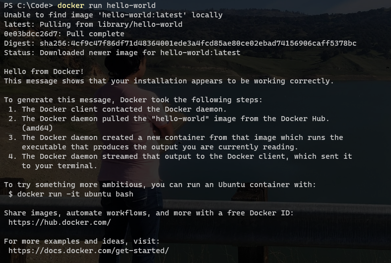

# Introduction to Docker

Docker is a set of platform as a service (PaaS) products that use OS-level virtualization to deliver software in packages called containers.
Containers are isolated from one another and bundle their own software, libraries and configuration files, they can communicate with each other through well-defined channels.
All containers are run by a single operating system kernel and therefore use fewer resources than virtual machines.

## Softwares to Download

Docker Desktop for Windows or Mac from <https://www.docker.com>
WSL2 in case of Windows only

## Lets start with running few commands

1; Find out the version of Docker in your Machine.

``` cmd
docker –-version
```

In my machine I got following output

``` cmd
Docker version 19.03.12, build 48a66213fe
```

2; Running a "Helllo-World" container on Docker

``` cmd
docker run hello-world
```

You will see something like this:

